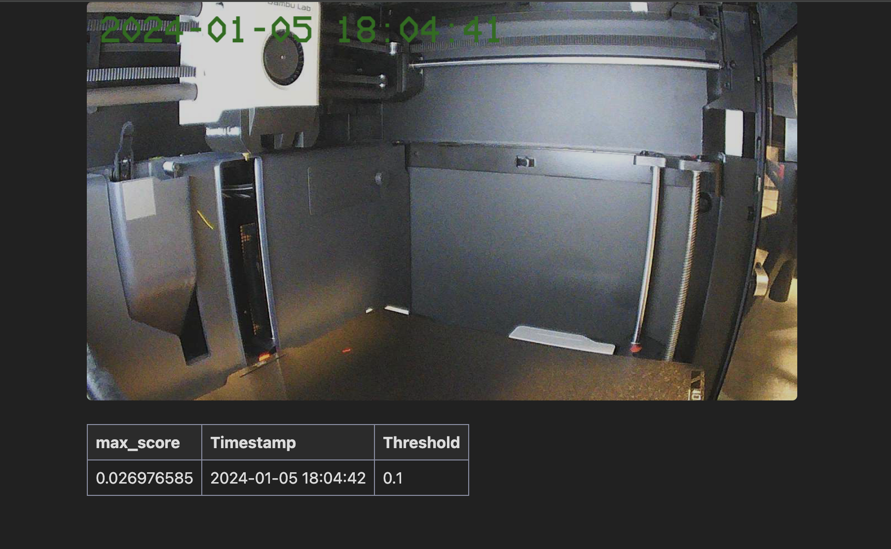

# Bambu P1 Camera Streamer + AI to detect spaghetti
This is a dockerized version of the Bambu P1 Camera Streamer + AI to detect spaghetti.

This is based on work of:
 * https://github.com/antirez/failed-3d-prints-bot - basis for the AI detection code
 * https://github.com/hisptoot/BambuSource2Raw - basis for the streamer
 * https://github.com/slynn1324/BambuP1Streamer - basis for this project
 * https://bjh21.me.uk/bedstead/ - font for image overlay
 * https://github.com/AlexxIT/go2rtc - streaming in the browser
 * https://github.com/TheSpaghettiDetective/obico-server/ - neural network model

## License
This project is a collection of other projects. 
Please see the individual projects for their licenses. 
My changes are released under MIT.

## RUN
Plug in the right values for the environment variables into `.env`
```
docker-compose up -d --build
```

### Example `.env`
```
PRINTER_ADDRESS=192.168.1.111
PRINTER_ACCESS_CODE=12345678
REFRESH_RATE=10
```

### docker-compose.yml

```yaml
version: '3.7'
services:
  app:
    build: ./
    restart: unless-stopped
    env_file:
      - .env
    ports:
      - "1984:1984"
      - "8080:8080"
    logging:
      driver: json-file
      options:
        max-size: 50m
```


## Web Dashboard

Visit http://localhost:8080 to see the web dashboard with current ai detection status.



## Streamer
Only tested on a P1S. I would expect it to work for a p1p camera. I would not expect this to work on an X1/X1C - the codecs are different and I don't believe that local network streaming is enabled. 

Built and tested on Debian 12 / amd64. Other platforms may not work.

Derived from https://github.com/hisptoot/BambuSource2Raw.  

https://github.com/AlexxIT/go2rtc does most of the work.

### DEPENDENCIES

Bambu Studio Proprietary Plugin Library
```
wget https://public-cdn.bambulab.com/upgrade/studio/plugins/01.04.00.15/linux_01.04.00.15.zip
unzip linux_01.04.00.15.zip
```

Go2Rtc
```
wget https://github.com/AlexxIT/go2rtc/releases/download/v1.6.2/go2rtc_linux_amd64
chmod a+x go2rtc_linux_amd64
```

### ACCESS
#### Index Page (only the MJPEG parts will work)
```
http://localhost:1984/links.html?src=p1s
```

#### MJPEG url
```
http://localhost:1984/api/stream.mjpeg?src=p1s
```


